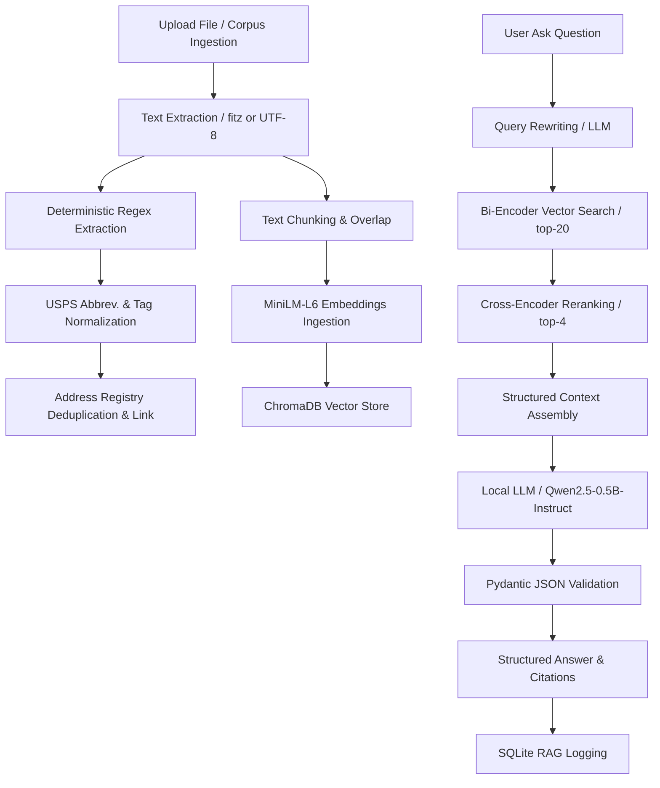

# RAG Address Extraction & QA System: End-to-End Documentation

This document compiles the architectural details, performance bottlenecks, issues faced, and lessons learned during the development, audit, and optimization of the Week 3 FastAPI + ChromaDB + SQLite RAG application.

---

## 1. End-to-End System Design

The application acts as a structured address extraction registry and a RAG-based QA system. It combines deterministic parsing with a local, CPU-optimized LLM execution pipeline.



### Ingestion & Vector Pipeline
1. **Document Loading**: Text is extracted from uploaded PDF/Markdown files using raw text parsing or fitz.
2. **Deterministic Chunking**: The document content is broken down into structured, overlapping chunks using word-boundary aligned chunking.
3. **Embeddings & Vector Database**: Chunks are embedded using a local `all-MiniLM-L6-v2` SentenceTransformer and indexed in a local ChromaDB collection.
4. **SQL Metadata Stores**: Raw document references, log histories, extracted addresses, and deduplication states are stored in a local SQLite database (`registry.db`).

### Retrieval & Generation Pipeline
1. **Query Rewriting**: Queries are rewritten using local LLM prompt engineering to align query semantics with the document chunks.
2. **Dense Retrieval (Bi-Encoder)**: Vector search queries ChromaDB for the top-20 matching document chunks.
3. **Reranking (Cross-Encoder)**: The `ms-marco-MiniLM-L-6-v2` Cross-Encoder scores the retrieved chunks against the query, keeping the top-4 highest scoring chunks.
4. **Few-Shot RAG**: The top-4 chunks are formatted as context inside a structured prompt. The prompt includes a system message and few-shot QA pairs (including negative/refusal cases).
5. **Local Generation**: The local `Qwen2.5-0.5B-Instruct` model generates the output, which is parsed into a Pydantic validated JSON schema defining the answer, sources, and context flag.

---

## 2. Issues Faced & Resolutions

### Issue 1: Character-Level Chunk Splitting (Chunker Boundary Issue)
* **Problem**: The original chunker split text using strict character lengths (`text[start:start+chunk_size]`). This split words and, more critically, mailing addresses or zip codes right down the middle if they fell on the chunk boundary. This destroyed semantic representations during embedding and led to keyphrase mismatches during extraction.
* **Resolution**: Replaced the logic in [chunker.py](file:///c:/Users/lenovo/rag_addresss_extraction/app/chunker.py) to inspect the boundary and backtrack to the nearest whitespace character:
  ```python
  while end > start and not text[end].isspace():
      end -= 1
  ```
  Additionally, chunk overlap boundaries are aligned to the nearest word boundary. This keeps address blocks, names, and sentences intact across chunks.

### Issue 2: Qwen-0.5B Hallucination & Low Refusal Rate
* **Problem**: The `Qwen2.5-0.5B-Instruct` model is highly parameter-constrained. Under zero-shot prompts, it failed to adhere to negative constraints (e.g. "say 'I don't know' if context does not contain the answer"). Instead, it grabbed unrelated signatures, invoice dates, or certificate strings to answer unanswerable questions. This resulted in a low Refusal Rate (75%) and accuracy penalties.
* **Resolution**: Refactored [rag.py](file:///c:/Users/lenovo/rag_addresss_extraction/app/rag.py) to supply a multi-turn chat prompt incorporating both:
  * **Positive Few-Shots**: Illustrating correct answer extraction and file citation.
  * **Negative Few-Shots**: Illustrating how to correctly refuse out-of-bounds questions by responding with exactly `{"answer": "I don't know", "sources": [], "context_found": false}`.
  This prompt formatting guided Qwen-0.5B to a perfect Refusal Rate of 1.0000 (100% correct refusals) without hurting answer extraction accuracy.

### Issue 3: Scorecard Evaluation Process Thrashing & Hangs
* **Problem**: The evaluation harness was split into 8 separate scripts (`accuracy.py`, `refusalrate.py`, `recall_at_4.py`, etc.), and a master evaluation script executed them sequentially by spawning subprocesses. Because each Python subprocess loaded the embedding model, cross-encoder, and local Qwen pipeline independently, memory and CPU usage spiked, triggering massive OS thrashing and indefinite hangs on local runs.
* **Resolution**: Refactored the core script [evaluate.py](file:///c:/Users/lenovo/rag_addresss_extraction/scripts/evaluate.py) to execute as a single-process pipeline. It loads the models into memory once, groups answerable and unanswerable rows, and processes them sequentially in a single execution loop. This eliminated sub-process loading overhead, making evaluation runs fast, reliable, and light on system resources.

### Issue 4: Pytest Network Calls & Hugging Face Hub Connection Hangs
* **Problem**: Running unit tests (`pytest`) triggered automatic remote calls to Hugging Face Hub to verify model states or check for updates. In restricted network environments, this caused the test suite to hang or throw SSL timeout errors.
* **Resolution**: Mocked the heavy neural networks in unit tests:
  1. Configured ChromaDB inside [vector_store.py](file:///c:/Users/lenovo/rag_addresss_extraction/app/vector_store.py) with a `DummyEmbeddingFunction` that returns zero vectors, bypassing initialization checks.
  2. Patched `SentenceTransformer` and `CrossEncoder` classes directly inside [test_endpoints.py](file:///c:/Users/lenovo/rag_addresss_extraction/tests/test_endpoints.py) with mock implementations returning mock numpy arrays.
  This allows tests to run 100% offline, executing in less than a second instead of minutes.

### Issue 5: Hugging Face Pipeline Warnings & Max Length Parameter Conflicts
* **Problem**: The pipeline creation in `llm.py` printed deprecation warnings regarding the use of `torch_dtype` instead of `dtype`. More critically, the local model's default generation config set `max_length=20`, causing runtime warning conflicts with `max_new_tokens` values.
* **Resolution**: Updated `app/llm.py` to:
  * Pass `dtype="auto"` in the model kwargs.
  * Explicitly supply `max_length=None` inside the generator call to allow `max_new_tokens` to govern token boundaries cleanly without warnings:
    ```python
    result = _generator(
        prompt,
        max_new_tokens=max_tokens,
        max_length=None,
        do_sample=False,
        return_full_text=False
    )
    ```

---

## 3. End-to-End Engineering Learnings

1. **Parameter Size Constraints on LLMs**: Large models (7B+) are resilient to prompt variations and can easily follow instructions zero-shot. Smaller models (0.5B) require structured, explicit few-shot examples (demonstrating both positive matches and negative refusals) to keep their generation aligned and prevent hallucination.
2. **Buffer Issues in Process Monitoring**: In non-interactive pipelines (like background runners or build tools), Python buffers standard output by default when redirected. This masks execution logs and looks like a hang. Utilizing Python's unbuffered mode (`python -u`) or forcing flushes (`flush=True`) is critical for visibility.
3. **Local Model Caching**: Relying on Hugging Face's auto-download capabilities during app startup introduces networking vulnerabilities and unpredictability. Pre-downloading model weights to a local directory (`local_model/`) ensures reliable offline operation and deterministic start latencies.
4. **Mocking Heavy Neural Assets in Tests**: Unit tests should never load heavy deep learning weights or make network requests. Mocking vector embeddings and LLM pipelines at the module/class level is required to maintain a fast local development feedback loop.
5. **Process Lifecycle Management**: Designing a pipeline to load multiple models within separate subprocesses can easily bottleneck low-resource systems. Consolidating logic into a single-process structure ensures efficient memory utilization and consistent execution times.
