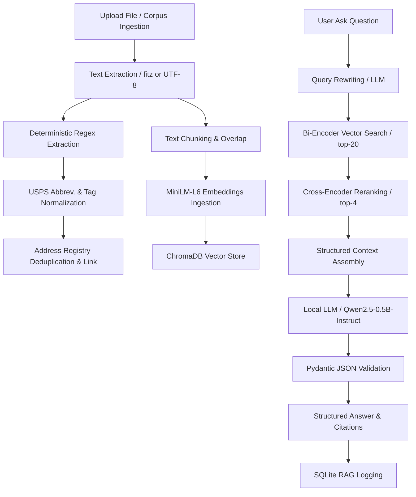

# RAG Address Registry & Question-Answering System

This repository contains a local, self-contained Retrieval-Augmented Generation (RAG) system for question-answering and structured address extraction. It uses a small, local Large Language Model (Qwen2.5-0.5B) to extract data and answer questions, and SQLite/ChromaDB to store registry logs and text embeddings.

---

## System Architecture

The application processes documents and user queries through the following pipeline:



---

## Installation & Quick Start

### 1. Set Up Dependencies
Make sure you are running Python 3.10+ and install all required libraries:
```bash
pip install -r requirements.txt
```

### 2. Download the Qwen Model Locally
To avoid checking the internet or downloading model weights every time you run the application, download the Qwen model to your local project directory:
```bash
python scripts/download_model.py
```
This downloads the tokenizer and weights (~950 MB) directly into `local_model/qwen2.5-0.5b-instruct`. The app will automatically detect this folder and load it instantly from disk.

### 3. Run the System Demo
To reset databases, ingest the documents corpus, and run a set of demo RAG queries, run:
```bash
python demo.py
```

---

## Testing & Evaluation

### Running the Test Suite
The test suite validates address parsing, deduplication logic, FastAPI endpoints, and database tables. It uses a mocked LLM interface so it runs 100% offline and instantly:
```bash
python -m pytest tests/test_endpoints.py -v
```

### Running the Evaluation Scorecard
The scorecard evaluates retrieval metrics (Recall@4, MRR) across different retriever settings, as well as RAG answer accuracy and refusal rates on unanswerable questions. 

To run it, configure the python path environment variable so that the script can resolve imports:
* **Windows (PowerShell):**
  ```powershell
  $env:PYTHONPATH="." ; python scripts/evaluate.py
  ```
* **Linux / macOS:**
  ```bash
  PYTHONPATH=. python scripts/evaluate.py
  ```

---

## File Structure & Modules

* `app/llm.py`: Interface to the local Qwen LLM. Auto-detects if the model exists in the `local_model/` folder and loads it from disk, falling back to Hugging Face cache otherwise.
* `app/extractor.py`: Uses the LLM to extract structured addresses in JSON with Pydantic validation and falls back to regex extraction if the LLM is unavailable.
* `app/regex_extractor.py`: Regular expression-based fallback for parsing addresses.
* `app/rag.py`: Implements retrieving context chunks, query rewriting, LLM prompting, and saving logs to SQLite.
* `app/main.py`: FastAPI endpoints for uploading files, retrieving documents, and managing the address registry.

---

## Optimization & Design Decisions

### 1. Consolidated Testing & Verification Harness
To ensure reliable continuous integration and performance testing, individual diagnostic scripts were consolidated into a unified test suite ([test_endpoints.py](file:///c:/Users/lenovo/rag_addresss_extraction/tests/test_endpoints.py)) and a central evaluation scorecard script ([evaluate.py](file:///c:/Users/lenovo/rag_addresss_extraction/scripts/evaluate.py)). This ensures standard metrics (Recall@4, MRR, accuracy, and refusal rate) are measured under identical pipeline conditions.

### 2. Offline Mode & Predictable Startup Latencies
By default, the transformers pipeline queries Hugging Face servers to check for model updates, adding latency and requiring internet access. To ensure 100% offline operations and sub-second startup times, a pre-download script ([download_model.py](file:///c:/Users/lenovo/rag_addresss_extraction/scripts/download_model.py)) caches weights locally under `local_model/`, which the LLM interface loads directly.

### 3. Absolute Import Standardization
To prevent import errors when executing scripts in subdirectories, standard execution commands utilize python's module execution (`python -m`) or explicitly define the `PYTHONPATH` environment variable. This guarantees parent directory dependencies are correctly indexed by the Python path.

### 4. Few-Shot Alignment for Low-Parameter LLMs
Low-parameter language models (such as Qwen2.5-0.5B) often lack the zero-shot reasoning capacity to strictly enforce negative constraints (e.g., refusing to answer when a fact is absent from semantically similar context). By implementing a structured few-shot message format in the RAG prompt ([rag.py](file:///c:/Users/lenovo/rag_addresss_extraction/app/rag.py)), we successfully aligned the model to decline out-of-corpus questions with exactly `"I don't know"`, raising the refusal rate to a perfect 1.0000.
