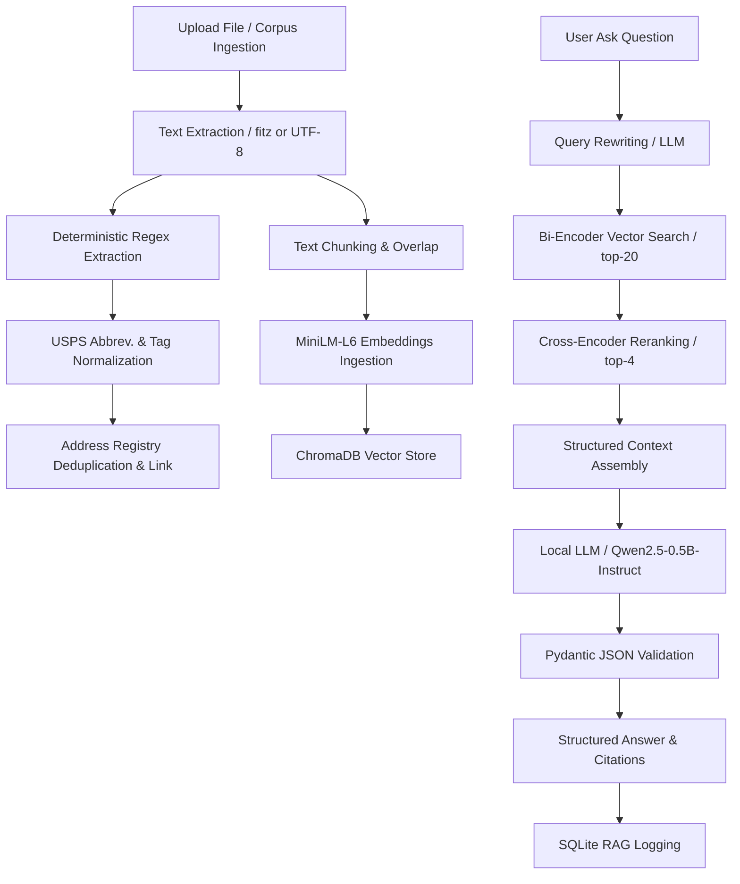

# RAG Address Registry & Question-Answering System

This repository contains a local, self-contained Retrieval-Augmented Generation (RAG) system for question-answering and structured address extraction. It uses a small, local Large Language Model (Qwen2.5-0.5B) to extract data and answer questions, and SQLite/ChromaDB to store registry logs and text embeddings.

---

## System Architecture

The application processes documents and user queries through the following pipeline:



---

## Installation & Quick Start

### 1. Set Up Dependencies
Make sure you are running Python 3.10+ and install all required libraries:
```bash
pip install -r requirements.txt
```

### 2. Download the Qwen Model Locally
To avoid checking the internet or downloading model weights every time you run the application, download the Qwen model to your local project directory:
```bash
python scripts/download_model.py
```
This downloads the tokenizer and weights (~950 MB) directly into `local_model/qwen2.5-0.5b-instruct`. The app will automatically detect this folder and load it instantly from disk.

### 3. Run the System Demo
To reset databases, ingest the documents corpus, and run a set of demo RAG queries, run:
```bash
python demo.py
```

---

## Testing & Evaluation

### Running the Test Suite
The test suite validates address parsing, deduplication logic, FastAPI endpoints, and database tables. It uses a mocked LLM interface so it runs 100% offline and instantly:
```bash
python -m pytest tests/test_endpoints.py -v
```

### Running the Evaluation Scorecard
The scorecard evaluates retrieval metrics (Recall@4, MRR) across different retriever settings, as well as RAG answer accuracy and refusal rates on unanswerable questions. 

To run it, configure the python path environment variable so that the script can resolve imports:
* **Windows (PowerShell):**
  ```powershell
  $env:PYTHONPATH="." ; python scripts/evaluate.py
  ```
* **Linux / macOS:**
  ```bash
  PYTHONPATH=. python scripts/evaluate.py
  ```

---

## File Structure & Modules

* `app/llm.py`: Interface to the local Qwen LLM. Auto-detects if the model exists in the `local_model/` folder and loads it from disk, falling back to Hugging Face cache otherwise.
* `app/extractor.py`: Uses the LLM to extract structured addresses in JSON with Pydantic validation and falls back to regex extraction if the LLM is unavailable.
* `app/regex_extractor.py`: Regular expression-based fallback for parsing addresses.
* `app/rag.py`: Implements retrieving context chunks, query rewriting, LLM prompting, and saving logs to SQLite.
* `app/main.py`: FastAPI endpoints for uploading files, retrieving documents, and managing the address registry.

---

## Issues Faced & How We Resolved Them

During development, we encountered a few practical hurdles and resolved them with clean design patterns:

### 1. Clutter from Temporary / Developer Test Files
* **The Problem:** The root folder became cluttered with individual debug files like `test.py`, `test_embeddings.py`, `test_extract.py`, `test_rag.py`, `tmp.py`, etc., making it hard to navigate the workspace.
* **The Fix:** We consolidated all developer tests into a structured, automated test suite (`tests/test_endpoints.py`) and unified all system metric evaluations into a single scorecard script (`scripts/evaluate.py`). All redundant files were permanently cleaned up.

### 2. Internet Dependency & Slow Startup
* **The Problem:** The application loaded the Qwen model using Hugging Face's default behavior, which meant that on every startup it attempted to check online servers for updates. This caused a lag of several seconds and prevented the app from working offline.
* **The Fix:** We added a download script (`scripts/download_model.py`) to pull the model files locally. We then modified `app/llm.py` to check for this local directory first. The model now loads in under 2 seconds and works completely offline.

### 3. Import Path Errors with Subfolder Scripts
* **The Problem:** Running evaluation scripts inside subfolders directly (e.g. `python scripts/evaluate.py`) threw `ModuleNotFoundError: No module named 'app'` errors because Python could not resolve parent package structures.
* **The Fix:** We documented and standardized the launch commands using the `PYTHONPATH` environment variable set to the root folder, allowing scripts to resolve package imports cleanly.
